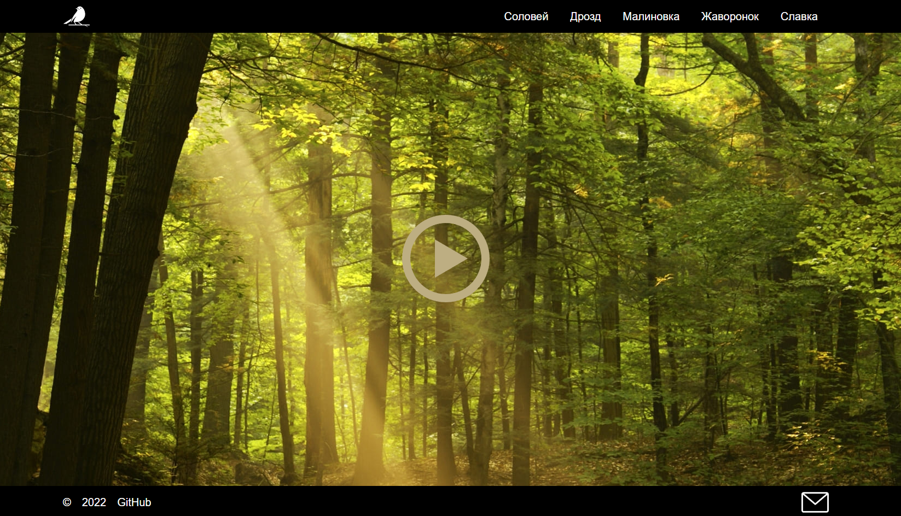

## eco-sounds

## Описание проекта
EcoSounds - приложение в котором при кликах по интерактивным элементам можно переключать изображение и звук.

<kbd></kbd>

- Вёрстка состоит из трёх блоков: `<header>`, `<main>`, `<footer>`
- Блок `<main>` состоит из одного контейнера `
`
  
[Деплой проекта](https://zixail28.github.io/ecosounds/)  
